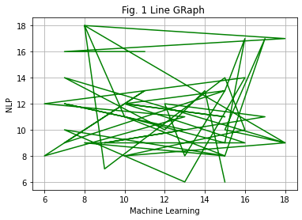

# Matplotlib (Visualization Lybrary)

```python
import matplotlib.pyplot as plt # mat plot lib
import seaborn as sns # sea born
import pandas as pd
import numpy as np
```

```python
pwd
```

    'F:\\EDUCTIONAL\\Semister\\12th Semister\\Data Mining\\Lab'

```python
# import data
df = pd.read_csv('Sample Dataset.csv')
df
```

<div>
<table border="1" class="dataframe">
  <thead>
    <tr style="text-align: right;">
      <th></th>
      <th>Machine Learning</th>
      <th>NLP</th>
      <th>AI</th>
      <th>Section</th>
    </tr>
  </thead>
  <tbody>
    <tr>
      <th>0</th>
      <td>11</td>
      <td>16</td>
      <td>7</td>
      <td>A</td>
    </tr>
    <tr>
      <th>1</th>
      <td>7</td>
      <td>16</td>
      <td>10</td>
      <td>A</td>
    </tr>
    <tr>
      <th>2</th>
      <td>18</td>
      <td>17</td>
      <td>13</td>
      <td>A</td>
    </tr>
    <tr>
      <th>3</th>
      <td>8</td>
      <td>18</td>
      <td>15</td>
      <td>A</td>
    </tr>
    <tr>
      <th>4</th>
      <td>10</td>
      <td>11</td>
      <td>18</td>
      <td>A</td>
    </tr>
    <tr>
      <th>5</th>
      <td>7</td>
      <td>12</td>
      <td>8</td>
      <td>A</td>
    </tr>
    <tr>
      <th>6</th>
      <td>13</td>
      <td>10</td>
      <td>10</td>
      <td>A</td>
    </tr>
    <tr>
      <th>7</th>
      <td>9</td>
      <td>9</td>
      <td>15</td>
      <td>A</td>
    </tr>
    <tr>
      <th>8</th>
      <td>17</td>
      <td>11</td>
      <td>18</td>
      <td>A</td>
    </tr>
    <tr>
      <th>9</th>
      <td>12</td>
      <td>12</td>
      <td>9</td>
      <td>A</td>
    </tr>
    <tr>
      <th>10</th>
      <td>13</td>
      <td>8</td>
      <td>12</td>
      <td>A</td>
    </tr>
    <tr>
      <th>11</th>
      <td>15</td>
      <td>13</td>
      <td>13</td>
      <td>A</td>
    </tr>
    <tr>
      <th>12</th>
      <td>10</td>
      <td>12</td>
      <td>10</td>
      <td>A</td>
    </tr>
    <tr>
      <th>13</th>
      <td>15</td>
      <td>11</td>
      <td>7</td>
      <td>A</td>
    </tr>
    <tr>
      <th>14</th>
      <td>10</td>
      <td>12</td>
      <td>12</td>
      <td>B</td>
    </tr>
    <tr>
      <th>15</th>
      <td>16</td>
      <td>9</td>
      <td>6</td>
      <td>B</td>
    </tr>
    <tr>
      <th>16</th>
      <td>8</td>
      <td>9</td>
      <td>16</td>
      <td>B</td>
    </tr>
    <tr>
      <th>17</th>
      <td>15</td>
      <td>8</td>
      <td>8</td>
      <td>B</td>
    </tr>
    <tr>
      <th>18</th>
      <td>7</td>
      <td>10</td>
      <td>6</td>
      <td>B</td>
    </tr>
    <tr>
      <th>19</th>
      <td>13</td>
      <td>6</td>
      <td>18</td>
      <td>B</td>
    </tr>
    <tr>
      <th>20</th>
      <td>16</td>
      <td>14</td>
      <td>10</td>
      <td>B</td>
    </tr>
    <tr>
      <th>21</th>
      <td>6</td>
      <td>12</td>
      <td>14</td>
      <td>B</td>
    </tr>
    <tr>
      <th>22</th>
      <td>13</td>
      <td>11</td>
      <td>8</td>
      <td>B</td>
    </tr>
    <tr>
      <th>23</th>
      <td>6</td>
      <td>8</td>
      <td>10</td>
      <td>B</td>
    </tr>
    <tr>
      <th>24</th>
      <td>11</td>
      <td>13</td>
      <td>12</td>
      <td>B</td>
    </tr>
    <tr>
      <th>25</th>
      <td>7</td>
      <td>9</td>
      <td>14</td>
      <td>B</td>
    </tr>
    <tr>
      <th>26</th>
      <td>15</td>
      <td>13</td>
      <td>18</td>
      <td>B</td>
    </tr>
    <tr>
      <th>27</th>
      <td>16</td>
      <td>17</td>
      <td>12</td>
      <td>B</td>
    </tr>
    <tr>
      <th>28</th>
      <td>15</td>
      <td>9</td>
      <td>6</td>
      <td>B</td>
    </tr>
    <tr>
      <th>29</th>
      <td>10</td>
      <td>11</td>
      <td>15</td>
      <td>C</td>
    </tr>
    <tr>
      <th>30</th>
      <td>15</td>
      <td>8</td>
      <td>6</td>
      <td>C</td>
    </tr>
    <tr>
      <th>31</th>
      <td>17</td>
      <td>17</td>
      <td>11</td>
      <td>C</td>
    </tr>
    <tr>
      <th>32</th>
      <td>15</td>
      <td>10</td>
      <td>7</td>
      <td>C</td>
    </tr>
    <tr>
      <th>33</th>
      <td>18</td>
      <td>9</td>
      <td>8</td>
      <td>C</td>
    </tr>
    <tr>
      <th>34</th>
      <td>8</td>
      <td>18</td>
      <td>9</td>
      <td>C</td>
    </tr>
    <tr>
      <th>35</th>
      <td>9</td>
      <td>7</td>
      <td>12</td>
      <td>C</td>
    </tr>
    <tr>
      <th>36</th>
      <td>15</td>
      <td>14</td>
      <td>12</td>
      <td>C</td>
    </tr>
    <tr>
      <th>37</th>
      <td>16</td>
      <td>10</td>
      <td>13</td>
      <td>C</td>
    </tr>
    <tr>
      <th>38</th>
      <td>10</td>
      <td>8</td>
      <td>11</td>
      <td>C</td>
    </tr>
    <tr>
      <th>39</th>
      <td>18</td>
      <td>9</td>
      <td>18</td>
      <td>C</td>
    </tr>
    <tr>
      <th>40</th>
      <td>7</td>
      <td>14</td>
      <td>9</td>
      <td>C</td>
    </tr>
    <tr>
      <th>41</th>
      <td>12</td>
      <td>10</td>
      <td>8</td>
      <td>C</td>
    </tr>
    <tr>
      <th>42</th>
      <td>14</td>
      <td>13</td>
      <td>11</td>
      <td>C</td>
    </tr>
    <tr>
      <th>43</th>
      <td>15</td>
      <td>6</td>
      <td>11</td>
      <td>C</td>
    </tr>
  </tbody>
</table>
</div>


```python
df.plot()
```
    


# Line Graph

```python
# initializing the data
x = df["Machine Learning"] # pd.DataFrame(df,columns=['Machine Learning'])
y = df["NLP"] # pd.DataFrame(df,columns=['NLP'])

# plotting the data
plt.plot(x, y,color='green')

# Adding label on the x-axis
plt.xlabel('Machine Learning')
# Adding label on the y-axis
plt.ylabel('NLP')

# Adding title to the plot
plt.title('Fig. 1 Line GRaph ')

plt.grid(True)

plt.show()

# plt.savefig('Fig.png')
plt.close()
```
    

    
# Sub plot (Multiple Plots)

```python
 The subplot() function you can draw multiple plots in one figure
```

```python
# initializing the data
x = df["Machine Learning"]
y = df["NLP"]

# Creating the figure and subplots
# according the argument passed
fig, axes = plt.subplots(1, 2, gridspec_kw={'hspace': 0.5, 'wspace': 0.4})

# plotting the data in the
# 1st subplot
axes[0].plot(x, y)
axes[0].set_title('Machine Learning')
 
# plotting the data in the 1st
# subplot only
axes[0].plot(y, x)
 
# plotting the data in the 2nd
# subplot only
axes[1].plot(x, y)

plt.show()
```
    

    

# Scatter Plot
```
The scatter() function plots one dot for each observation.
```
```python
colours = {'A':'orange', 'B':'green', 'C':'blue'}

for i in range(len(df['Machine Learning'])):
  plt.scatter(df['NLP'][i],df['AI'][i], color = colours[df['Section'][i]])

plt.title('Scatter Plot')
plt.xlabel('NLP')
plt.ylabel('AI')

plt.grid(True)

plt.show()
```
    

    
```python
# initializing the data
x = df['Machine Learning']
y = df['AI']

# df.plot(kind='scatter', x='petal.length', y='petal.width',color='green',grid='True',title='Scatter Plot')  

# plotting the data
plt.scatter(x, y)
 
# Adding title to the plot
plt.title("Sample Dataset")
 
# Adding label on the y-axis
plt.ylabel('AI')
 
# Adding label on the x-axis
plt.xlabel('Machine Learning')
 
plt.show()
```


# Bar plots


```python
a= df['Section'].value_counts()
# Types
species_types = a.index
# Each Type Count
count = a.values
plt.bar(species_types,count,color = 'lightgreen')
plt.xlabel('species_types')
plt.ylabel('count')
plt.show()
```
    

    
```python
a
```

    B    15
    C    15
    A    14
    Name: Section, dtype: int64

```python
species_types
```

    Index(['B', 'C', 'A'], dtype='object')

```python
count
```
    array([15, 15, 14], dtype=int64)

```python
# initializing the data
x = df['Machine Learning']
y = df['AI']
 
# plotting the data
plt.bar(x, y)
 
# Adding title to the plot
plt.title("Sample Dataset")
 
# Adding label on the y-axis
plt.ylabel('AI')
 
# Adding label on the x-axis
plt.xlabel('Machine Learning')
 
plt.show()
```
    

    
# Box Plot

```python
length_width = df[['Machine Learning','NLP','AI']] #excluding species column
length_width.boxplot()
plt.xlabel('Major')
plt.ylabel('values')
plt.title("Sample Dataset analysis")
plt.show()
```


    
# Histogram
```
A histogram is a graph showing frequency distributions.
```
```python
# initializing the data
x = df['AI']
 
# plotting the data
plt.hist(x, color='green')
 
# Adding title to the plot
plt.title("Tips Dataset")
 
# Adding label on the y-axis
plt.ylabel('Frequency')
 
# Adding label on the x-axis
plt.xlabel('Section')
 
plt.show()
```


    
# Pie Chart

```python
a= df['Section'].value_counts()
#Types
species = a.index
# Each Type Count Data
count = a.values
colors= ['lightblue','lightgreen','gold']
explode = (0.2,0,0)
plt.pie(count, labels=species,shadow=True,
        colors=colors,explode = explode, autopct='%1.1f%%')
plt.xlabel('Section')
plt.axis('equal')
plt.show()
```
 

    
```
explode: Moving the wedges of the plot
autopct: Label the wedge with their numerical value.
color: Attribute is used to provide color to the wedges.
shadow: Used to create shadow of wedge.
```
# Seaborn (Visualization Lybrary)

# Line Graph

```python
sns.set_style('darkgrid')
# pandas axis = 0 refers to horizontal axis or rows and 
#        axis = 1 refers to vertical axis or columns.
sns.lineplot(data=df.drop(['Section'], axis=1))
plt.show()
```
    

    
```python
sns.lineplot(x='NLP', y='AI', data=df)
plt.show()
```   

    
# Scatter Plot

```python
sns.scatterplot(x='NLP', y='AI', data=df, hue='Section')
plt.show()
```
    

    
# Bar Plot

```python
a = df['Section'].value_counts()
species = a.index
count = a.values
sns.barplot(x = species, y=count)
plt.show()
```


    

```python
sns.barplot(x='AI',y='NLP', data=df, hue='Section')
  
plt.show()
```


    
# Histogram

```python
sns.histplot(x='AI', data=df, kde=True, hue='Section')
  
plt.show()
```


    
